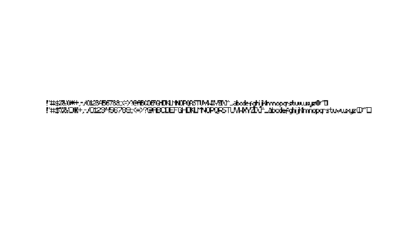

# AmigaFFH

<!-- badges: start -->

[](https://github.com/pepijn-devries/AmigaFFH/actions/workflows/R-CMD-check.yaml)
[](https://pepijn-devries.r-universe.dev/AmigaFFH)
[](https://CRAN.R-project.org/package=AmigaFFH)

<!-- badges: end -->

The Amiga File Format Handler package (AmigaFFH) is designed to
interpret file formats that were native to [Commodore
Amiga](https://en.wikipedia.org/wiki/Amiga) machines. In combination
with the adfExplorer package this package can be used to interpret older
file formats that were native to the Commodore Amiga. The focus of this
package will be on the older system (Amiga OS \<= 3.0). This will allow
you to analyse and interpret these files in the scripted environment of
R.

In the sections below there are some prominent examples of supported
file formats. For a more detailed overview, please consult the package
documentation (`?AmigaFFH`)

## Installation

> Get CRAN version

``` r
install.packages("ProTrackR")
```

> Get development version from R-Universe

``` r
install.packages("ProTrackR", repos = c('https://pepijn-devries.r-universe.dev', 'https://cloud.r-project.org'))
```

## Usage

Below there are some ultra-short demostrations of a selection of
supported Amiga file types

### IFF

The Interchange File Format (IFF) is and was a file container that could
hold any kind of data. Below is an example of a bitmap image stored as
such a file.

``` r
library(AmigaFFH)
#> Loading required package: tuneR

example.iff <-
  system.file("ilbm8lores.iff", package = "AmigaFFH") |>
  read.iff()

par(bg = "black")
plot(example.iff, interpolate = FALSE)
```

<!-- -->

### AmigaBasic

[AmigaBasic](https://en.wikipedia.org/wiki/Amiga_Basic) is a simple
interpreted programming language for the early Commodore Amiga’s. Its
code was stored in a binary format to save disk and memory space. Below
an example of how to read such a file.

``` r
system.file("demo.bas", package = "AmigaFFH") |>
  read.AmigaBasic()
#> OPEN "ball.shp" FOR INPUT AS 1
#> OBJECT.SHAPE 1,INPUT$(LOF(1),1)
#> CLOSE 1
#> OBJECT.X 1,320
#> OBJECT.Y 1,127
#> OBJECT.ON 1
#> OBJECT.START
#> LET t=0
#> PRINT "Press any key to continue..."
#> WHILE INKEY$ =""
#>   OBJECT.X 1, 320+200*SIN(t)
#>   OBJECT.Y 1, 127+100*COS(t)
#>   t=t+.001
#> WEND
#> SCREEN 1,320,256,3,1
#> WINDOW 1,"Bob Window",(0,0)-(297,242),31,1
#> PALETTE 0,1,1,1
#> PALETTE 1,.1333333,.4,.7333333
#> PALETTE 2,.2,.4,.7333333
#> PALETTE 3,.2666667,.4666667,.6666667
#> PALETTE 4,.4666667,.5333333,.6
#> PALETTE 5,.6,.6,.6
#> PALETTE 6,.6666667,.6666667,.6666667
#> PALETTE 7,.7333333,.7333333,.7333333
#> FOR i% = 0 TO 7
#>   COLOR i%
#>   AREA (i%*10, 30)
#>   AREA STEP (10, 0)
#>   AREA STEP (0, 10)
#>   AREA STEP (-10,0)
#>   AREAFILL
#> NEXT i%
#> OPEN "r_logo.shp" FOR INPUT AS 1
#> OBJECT.SHAPE 2,INPUT$(LOF(1),1)
#> CLOSE 1
#> OBJECT.X 2,160
#> OBJECT.Y 2,127
#> OBJECT.ON 2
#> PRINT "Press any key to stop..."
#> WHILE INKEY$=""
#>   OBJECT.X 2, 160+100*SIN(t*.3)
#>   OBJECT.Y 2, 127+50*COS(t)
#>   t=t+.01
#> WEND
#> SCREEN CLOSE 1
#> END
```

### Amiga File Icons

On the Amiga, file icons were stored as separate files. Below an example
of how to create such a file.

``` r
icon <- simpleAmigaIcon()
plot(icon, interpolate = FALSE)
```

<!-- -->

### Amiga Fonts

The Commodore Amiga used bitmap fonts to display texts. The package
comes with an example object that can be stored as an Amiga Font file.

``` r
data(font_example)

plot(font_example, interpolate = FALSE)
```

<!-- -->

### System configuration

The `systemconfiguration` file was used to store some system preferences
(screen resolution, font, default printer, etc.). It was loaded during
the boot process. The exaple below shows how to create such a file.

``` r
simpleSysConfig()
#> Amiga system-configuration
#> FontHeight:  8
#> Printer: parallel generic
#> Interlaced:  FALSE
```

## Developmental status

It has been years since the initial release of this package. Since it’s
release a lot has changed in R and in my skill set. I still have plans
for this package, but this requires drastic changes. Therefore, I will
only apply minimal maintenance to this package. Meanwhile I will work on
a complete overhaul which will be released in due time as a new package.
This new package will:

- have the same or similar features as the current package.
- implement rendering procedures in C++ giving the package a speed
  boost.

But until then, please enjoy the current package as is.
